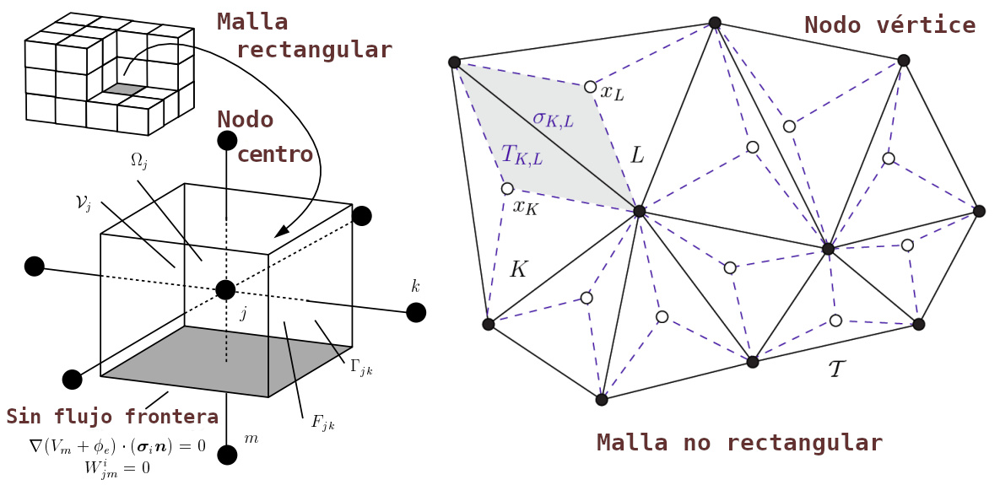
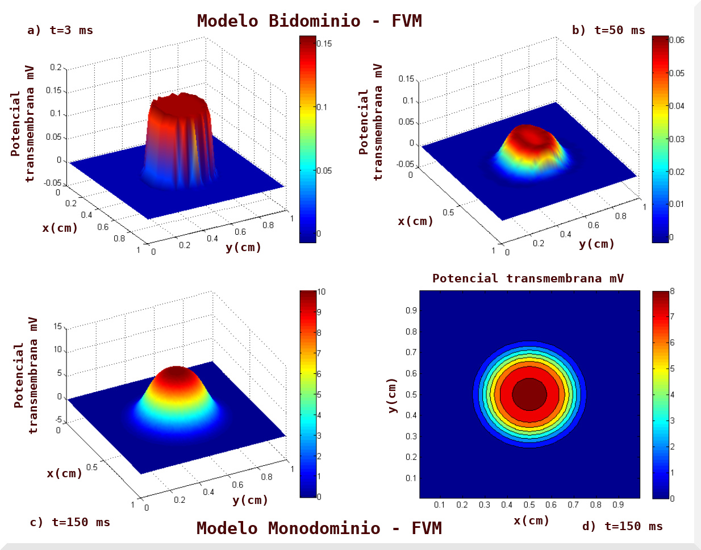

# FVM
## Método de Volúmenes Finitos 

Código de Simulación del modelo bidominio y monodominio, respectivamente, a partir del Método de Volúmenes Finitos (FVM) con desarrollo en el entorno Matlab-R2019 y Licencia GPL-GNU, enlace: https://github.com/osmanmx/FVM-code/blob/main/LICENSE.

El FVM e integración explícita de Euler se emplean en el presente proyecto para discretizar la dinámica espacio-temporal y resolver numéricamente tanto las ecuaciones del bidominio como del monodominio, respectivamente. Al final se presenta los gráficos resultantes de simulaciones numéricas realizadas con código desarrollado en el ambiente de trabajo Matlab® para ambos modelos y diseñado en el esquema de volúmenes finitos.

Una importante propiedad de FVM es que los principios de conservación de masa, momento y energía, son preservados por las ecuaciones discretas deducidas de su aplicación, es decir, para el tema de estudio de la propagación de la actividad eléctrica cardíaca, el flujo se conserva con el método de volúmenes finitos. De forma general el FVM cimienta su base en el siguiente algoritmo de trabajo:

  - Descomponer el dominio en volúmenes de control, la malla admisible.
  - Formular las ecuaciones integrales de conservación para cada volumen de control.
  - Aproximar numéricamente las integrales.
  - Aproximar los valores de las variables en las caras y derivadas con la información de las variables nodales.
  - Ensamblar y resolver el sistema algebraico obtenido.

## Malla admisible - Método de Volúmenes Finitos

    

        
    

 

El punto de partida del algoritmo FVM es la configuración de la malla admisible no necesariamente rectangular, como se muestra en la imagen anterior (figura33.jpg). Esto a partir de la descomposición del dominio en pequeños volúmenes de control, donde las variables a resolver son almacenadas en los nodos (variables nodales) que se pueden ubicar en los vértices de dicha malla o en los centros de los volúmenes de control. Por definición, un volumen de control no se superpone con puntos vecinos, de esta forma el volumen total resulta ser igual a la suma de los volúmenes de control considerados. Después de discretizar el espacio con la malla definiendo los volúmenes de control, las ecuaciones de conservación son descritas en su forma integral para cada volumen con la intención de obtener como resultado una versión discretizada de dicha ecuación. La siguiente imagen (figura35.jpg) esquematiza la simulación realizada por el FVM al modelo bidominio y monodominio, respectivamente.

## Captura de Pantalla - Simulación - Método de Volúmenes Finitos

    

        
    

 

## Referencias bibliográficas

Eymard, R. and Gallou\"{e}t, T. and Herbin, R. (2000). Finite volume methods. Handbook of Numerical Analysis, vol. VII. Primera edición, P.G. Ciarlet, J.L. Lions, North-Holland, Amsterdam, pp 713-1020.	
	
Moukalled, F. and Mangani, L. and Darwish, M. (2016). The Finite Volume Method in Computational Fluid Dynamics. Primera Edición, Springer-Verlag, New York, USA. doi: 10.1007/978-3-319-16874-6.
	
Henriquez, C.S. and Muzikant, A.L. and Smoak, C.K. (1996). Anisotropy, fiber curvature and bath loading effects on activation in thin and thick cardiac tissue preparations: Simulations in a three-dimensional bidomain model. Vol. 7(5), J. Cardiovasc. Electrophysiol, pp 424-444.

Trew, M.I. and Grice, L. and Smaill, B. and Pullan, A. (2005). A finite volume method for modeling discontinuous electrical activation in cardiac tissue. Vol. 33(5), Annals of Biomedical Engineering, pp 590-602.
